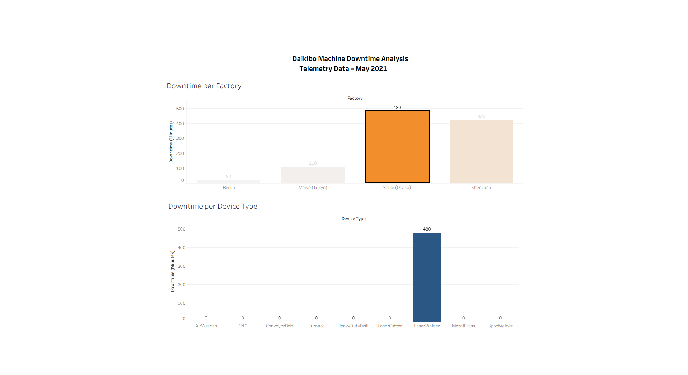

# Factory Machine Downtime Analysis (Tableau)

## Project Overview
This project analyzes machine telemetry data to identify factories and machine types responsible for the highest downtime.

## Dataset
Daikibo Telemetry Dataset containing machine health status across multiple factories.

Factories analyzed:
- Berlin
- Meiyo (Tokyo)
- Seiko (Osaka)
- Shenzhen

## Tools Used
- Tableau
- Data Visualization
- Calculated Fields
- Interactive Dashboards

## Data Preparation
A calculated field "Unhealthy" was created:

IF [status] = "unhealthy" THEN 10 ELSE 0 END

Each unhealthy record represents 10 minutes of downtime.

## Dashboard Insights
Highest Downtime Factory:
Seiko (Osaka)

Machine Causing Maximum Downtime:
LaserWelder

## Dashboard Preview

Interactive Tableau dashboard showing downtime across factories and machine types.

